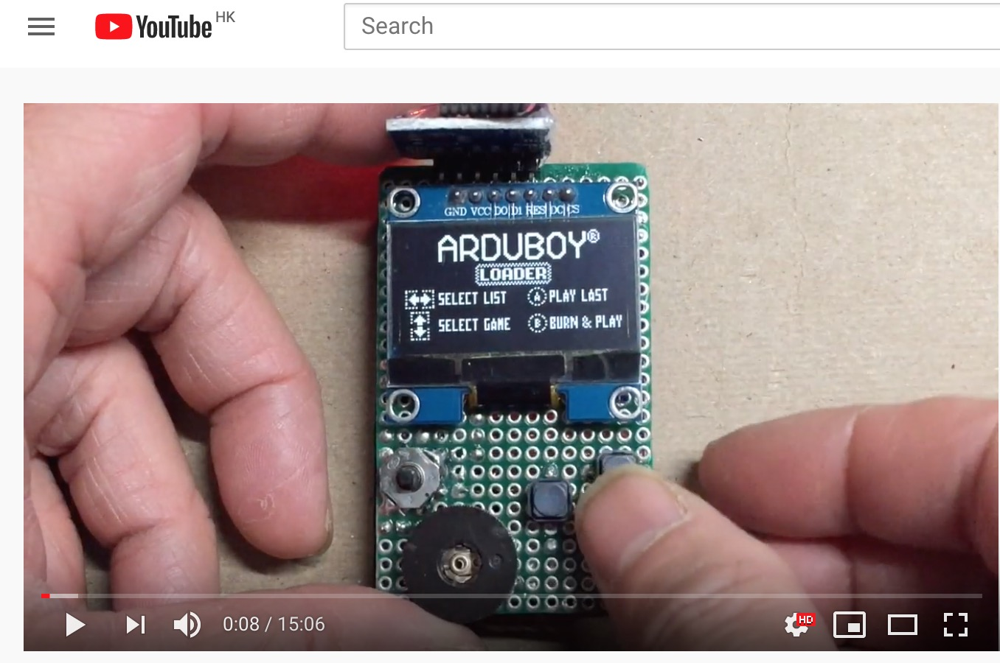

# ArduBaby
by : chuengbx   2020/1/1

ArduBaby is the half size Arduboy with serial flash that can store 500 games for playing on the road. This Github stores the schematics and example games binary images that you can make the serial flash.
Credit Card Arduboy with flashcart
 
This is a Credit Card arduboy that made perf boards and is smaller than half  of a credit card. 

Demonstration video.
https://youtu.be/kwJh4bO8yv4

Parts:
Arduino Pro Micro (or Arduino Micro)
1.3" mono  OLED with SPI interface on SSD1306 controller. The 7 pin male header of the OLED is plugged into the female header.
The OLED chosen must have the 7th pin for CS. Otherwise, it'll conflict with the Flahcart,
causing screen flickering and misalignment when loading games from flashcart or when playing  video stored on the flashcart
16MB serial flash to  load 500+ Arudboy games to be self-programmed to Arduino Micro anytime through the Cathy 3K bootloader
(original circuit, python scripts for game loading, and the Cathy 3K bootloader and homemade arduby package is designed by Mr.Blinky (inks below).
Replace the 5V LDO regulator with a 3.6V or 4.2V one, or to run the risk of damages to the serial flash when going about the max Voltage limit for a long time.
A 3.7-4.2V LIPO battery is connected to the RAW pin of the Arduino Pro Micro (which is sourced from the USB  port) to supply the power.
The LIPO battery is also charged by the 5V output from the Raw Pin when connected to the USB port of the computer or charger.
The battery protection board builtin to the LIPO Battery will avoid over charging.
Warning - please test the battery protection circuit on the LIPO battery first. If the battery protection circuit fails, it could cause a fire or overheat and burn your device.
To allow the board to be powerd off during charging, do not solder the EN pin of the LDO regulator when replacing it.
Leave it hanging there to connect to a switch that will select to connect to Ground (turn off) or to Raw (5V for turn on).
To use the serial flash for game loading, the Cathy 3K boot loader must be burnt to the Pro Micro using USBasp.

Credits and References to original authors of Arduboy and Flashcart:
 
1. Original Arduboy production schametics:  
    https://community.arduboy.com/t/production-arduboy-schematic/702
 
2. MR.Blinky's original design of flashcart: 
    https://github.com/MrBlinky/Arduboy/tree/master/flashcart
 
3. MR. Blinky;s GITHUB with python scripts and sample flash cart image binaries for sample games :
    https://github.com/MrBlinky/Arduboy-Python-Utilities
 
4. MR. Blinky's homemade package (required to operate the flash cart with alternate wiring and different types of OLED other than the  SSD1306 used in original Arduboy:
    https://github.com/MrBlinky/Arduboy-homemade-package
